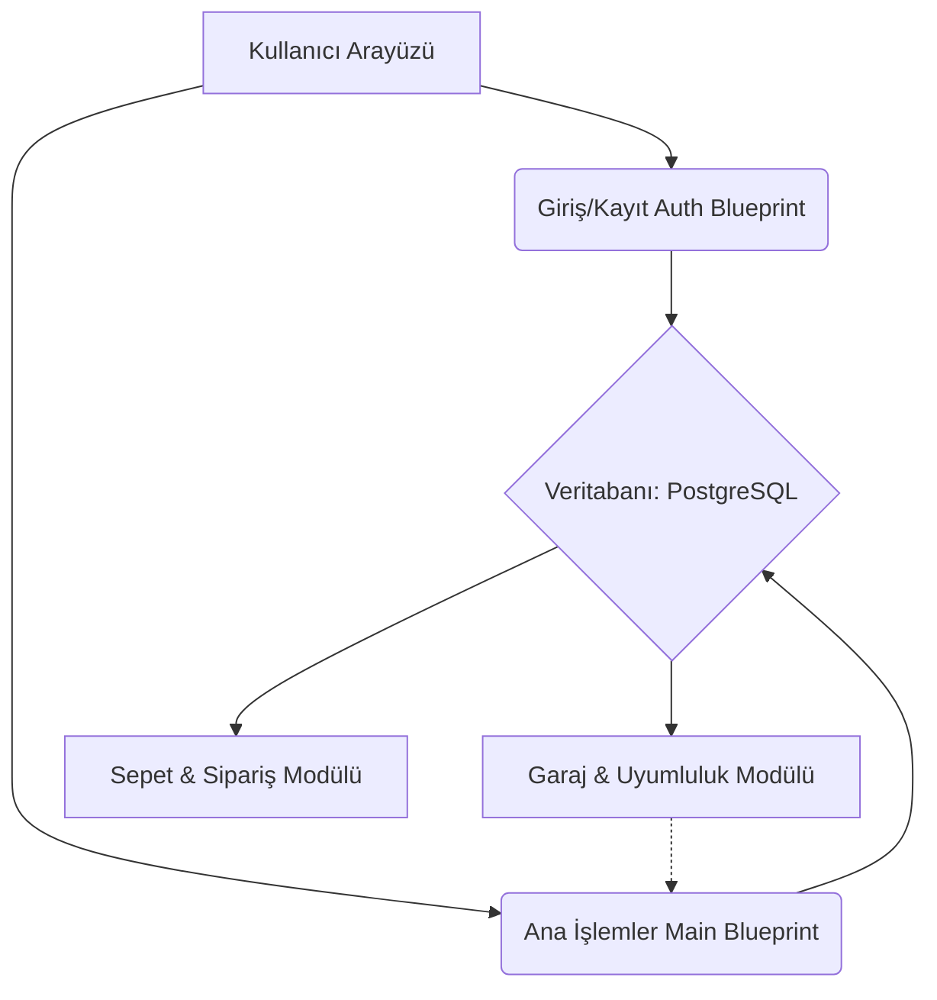

# OtoDepom - Proje Raporu
## Youtube Videosu Link https://youtu.be/iE0GLPCBNcI

## 1. Projenin Amacı ve Ne İşe Yaradığı
OtoDepom, araç sahiplerinin kendi marka ve modellerine uygun doğru yedek parçaları (motor yağı, akü, lastik vb.) kolayca bulup sipariş verebilecekleri "Next-Generation" premium bir e-ticaret platformudur. Kullanıcılar sisteme kendi araçlarını ekleyerek "Sanal Garaj"larını oluşturabilir, araçlarının muayene ve bakım tarihlerini takip edebilirler. Sistem, dinamik filtreleme ve uyumluluk algoritmasıyla kullanıcının sadece kendi aracına uygun ürünleri görmesini sağlayarak yanlış parça satın alma riskini ortadan kaldırır.

## 2. Mimari Özet
Projede "Application Factory" deseni ve "Blueprint" mimarisi kullanılarak yüksek ölçeklenebilirlik sağlanmıştır. `app/main/` ve `app/auth/` olmak üzere iki temel Blueprint kullanılmıştır. Veritabanı olarak geliştirme sürecinde SQLite, canlı (production) ortamda PostgreSQL kullanılmıştır ve tüm yapı Docker container'larına sarılmıştır.

## 3. Vibe Coding Deneyimim
Yapay zeka ile "Vibe Coding" yapmak, özellikle Tasarımda  ve veritabanı gibi karmaşık süreçleri çok fazla hızlandırdı. Ajanın oluşturduğu planı (Plan Modu) adım adım takip etmek, "tek prompt'ta koca projeyi istemek" gibi hatalara düşmemi engelledi. Ancak bazen yapay zeka CSS dosyalarını eski haline döndürmeye çalıştı veya eski migration dosyalarındaki sütunları Postgres'te hata verecek şekilde yorumladı; bu anlarda kontrolü ele alıp ajana müdahale etmem gerekti.

## 4. Antigravity'de En Faydalı Bulduğum 2 Özellik
1. **Tool Kullanımı (Terminal & File System):** Ajanın doğrudan bash komutlarını (`docker-compose`, `pip install`, `flask db migrate`) benim yerime çalıştırabilmesi, kurulum ve hata ayıklama süreçlerini %90 oranında kısalttı.
2. **Context Memory & AI Günlüğü:** Önceki oturumlarda alınan kararları unutmaması ve oturum oturum "AI Günlüğü" tutarak tüm prompt hatalarını belgelendirmesi akademik dürüstlük ve süreç takibi açısından mükemmeldi.

## 5. Ajanın Yakalayıp Düzelttiğim En Kritik 3 Hata
1. **Hata 1:** PostgreSQL'in `boolean` veri tiplerine çok katı (strict) olması sebebiyle SQLite'tan kalan `server_default=sa.text('0')` ifadesi çökmeye neden oldu. Ajanın ürettiği bu kodu `sa.text('false')` olarak değiştirerek çözdüm.
2. **Hata 2:** Ajanın Bootstrap `card` sınıflarını iç içe çok fazla kullanması sonucu "Karanlık Tema" bozuldu ve yazılar okunmaz (siyah üstüne siyah) oldu. İlgili div'lerdeki `text-theme-body` sınıflarını temizleyip standart `card-body`'ye dönerek UI'ı düzelttim.
3. **Hata 3:** Ajan özel hata sayfalarını (`404.html` ve `500.html`) tasarladı ancak bunları `app/__init__.py` içerisine global error handler olarak bağlamayı unuttu. Bu nedenle hatalarda varsayılan beyaz sayfa görünüyordu; bunu fark edip ajana yönlendirdim.

## 6. Sıfırdan AI Olmadan Yapsaydım Ne Kadar Sürerdi?
Bu büyüklükteki tam teşekküllü (sepet, sipariş, garaj uyumluluğu, dinamik filtre, dark mode) bir e-ticaret platformunu sıfırdan, tek satır AI kullanmadan yazsaydım muhtemelen **3-4 hafta** sürerdi. AI ile tüm bu mimari tasarım, kodlama, testler ve Dockerizasyon aşaması parçalı oturumlar halinde toplamda birkaç günümü aldı. Geliştirme süresinde **~%80 oranında bir hız avantajı** sağladı.

## 7. Gelecek Adımlar
Sunucuya tam yetkili bir şekilde alırsam, ilk ekleyeceğim özellik Iyzico veya Stripe üzerinden GERÇEK ÖDEME SİSTEMİ entegrasyonu olurdu. Araç bakım bildirimleri için sisteme kleyerek kullanıcılara bakım tarihi yaklaştığında **E-Posta (SMTP) gönderimi** yapılmasını sağlardım.
